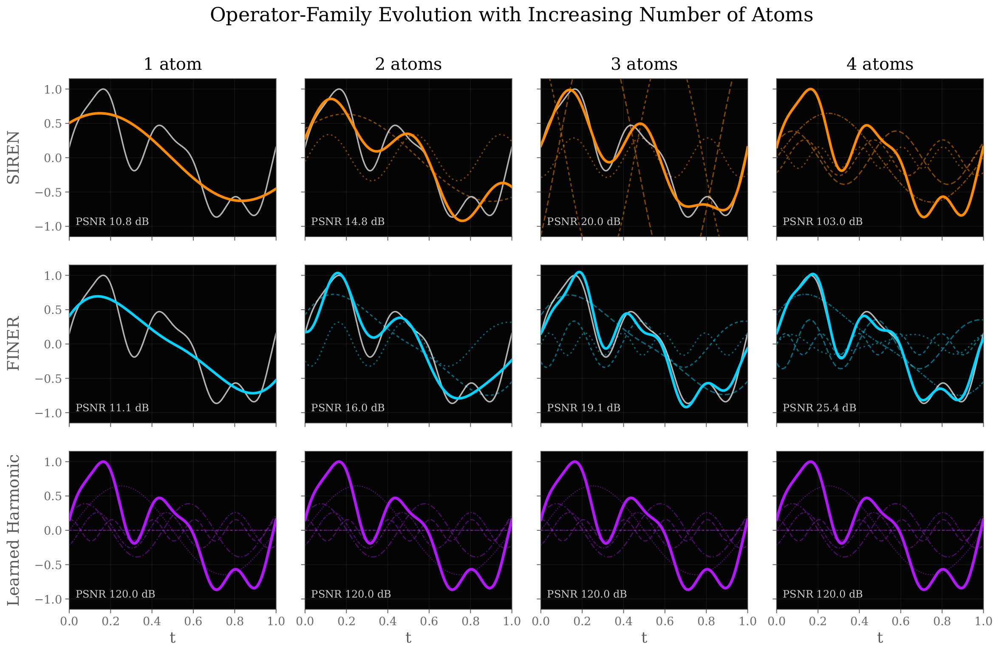

# Learnable Spectral Activations

**Tamir Shor, Or Litany, Alex Bronstein**

This repository contains the official implementation of the NeurIPS 2026 paper: [Learnable Spectral Activations](https://arxiv.org/pdf/TBD)



The repository contains the main audio and 2D image-fitting experiments from the paper. The two experiment directories share one environment and retain their original models, training settings, data subsets, and reference results.

## Installation

Create the environment and run all commands below from the repository root:

```console
conda env create -f environment.yml
conda activate lsa
```

The environment installs Python 3.10 and PyTorch 2.10 with CUDA 13.0. GPU training requires a compatible NVIDIA driver. Dependencies for both experiments are included.

The code is organized by experiment:

| Directory | Contents |
| --- | --- |
| `audio/` | Python entry points for the core, fJNB, and SL2A experiments |
| `audio/scripts/` | Audio models, preprocessing, and training routines |
| `audio/manifests/` | Fixed NSynth and LibriSpeech clip lists |
| `image_2d/` | Python entry points for the core, STAF, and SL2A experiments |
| `image_2d/lsa/` | Image models and training routines |
| `image_2d/configs/` | Kodak experiment settings and search grids |
| `audio/reference/`, `image_2d/reference/` | Results supplied with the original repositories |

## Audio

These experiments fit individual signals from 10 NSynth clips and 40 LibriSpeech clips. All methods use the same clip lists in `audio/manifests/`.

### Data

Download the **NSynth validation** split from [NSynth](https://magenta.tensorflow.org/datasets/nsynth) and **LibriSpeech dev-clean and dev-other** from [OpenSLR](https://www.openslr.org/12). The following commands download and extract each archive into the expected location:

```console
python audio/download_data.py --dataset nsynth
python audio/download_data.py --dataset librispeech
```

To download both in one command, use `--dataset both`. Archives are kept in `audio/data/archives/`.

For manual setup, download [nsynth-valid.jsonwav.tar.gz](https://huggingface.co/datasets/confit/nsynth/resolve/main/nsynth-valid.jsonwav.tar.gz) and extract it into `audio/data/`. Its expected SHA-256 is `00dea2645fbe0069258567da30807a90825e0bab54c077d6481f253096c4e2a0`. Download both [dev-clean.tar.gz](https://www.openslr.org/resources/12/dev-clean.tar.gz) and [dev-other.tar.gz](https://www.openslr.org/resources/12/dev-other.tar.gz), and extract them into `audio/data/librispeech_raw/`. Keep the directories inside each archive. For example, these files must be reachable at:

```text
audio/data/nsynth-valid/audio/bass_synthetic_009-009-025.wav
audio/data/librispeech_raw/LibriSpeech/dev-clean/1272/128104/1272-128104-0000.flac
audio/data/librispeech_raw/LibriSpeech/dev-other/116/288045/116-288045-0000.flac
```

Existing datasets can be copied or symlinked to those locations. To store them elsewhere, use `--out /path/to/audio-data` when downloading and `--data-root /path/to/audio-data` when training. That directory must contain `nsynth-valid/` and `librispeech_raw/` with the same structure shown above. Only the selected dataset is needed for a single-dataset run.

Keep the original audio files. The training code performs resampling and takes 48,000 samples at 48 kHz. No separate conversion or preprocessing command is needed. The released LSA, FINER, SIREN, and SL2A runs use zero-mean, unit-peak waveform targets. The fJNB comparison preserves its historical preprocessing and uses decoded waveform amplitudes without this normalization.

### LSA, FINER, and SIREN

Each command below fits one method to all 50 clips across both datasets, using GPU 0.

LSA uses 16 Fourier bands with scale 100 and 16 activation harmonics:

```console
python audio/run_core.py --method lsa --dataset both --gpu 0
```

FINER uses 16 Fourier bands with scale 20 and the released bias initialization:

```console
python audio/run_core.py --method finer --dataset both --gpu 0
```

SIREN uses raw coordinates with frequency parameter 30:

```console
python audio/run_core.py --method siren --dataset both --gpu 0
```

Replace `both` with `nsynth` or `librispeech` to run only that dataset. For example, `--method lsa --dataset nsynth` runs the 10-clip NSynth LSA experiment.

### fJNB

The raw-coordinate comparison uses degree 6 for NSynth and degree 2 for LibriSpeech:

```console
python audio/run_fjnb.py --dataset both --input raw --gpu 0
```

The Fourier-feature comparison uses 16 bands with scale 100 and degree 6 for both datasets:

```console
python audio/run_fjnb.py --dataset both --input ff16 --gpu 0
```

Each command runs 50 fits. Use `--input both` to run both comparisons, for 100 fits in total.

### SL2A

Run all four combinations of degree 256 or 512 and rank 64 or 128 on both datasets, for 200 fits:

```console
python audio/run_sl2a.py --dataset both --degree all --rank all --gpu 0
```

To run one setting on one dataset, select its degree and rank explicitly. This command runs 10 NSynth fits with degree 512 and rank 128:

```console
python audio/run_sl2a.py --dataset nsynth --degree 512 --rank 128 --gpu 0
```

### Outputs and settings

All audio entry points accept the following arguments:

| Argument | Meaning | Default |
| --- | --- | --- |
| `--dataset` | `nsynth`, `librispeech`, or `both` | `both` |
| `--gpu` | CUDA device index | `0` |
| `--data-root` | Parent of the dataset directories described above | `audio/data` |
| `--output-root` | Directory for results and logs | `audio/outputs` |
| `--device` | `cuda` or `cpu` | `cuda` |

For example, run LibriSpeech LSA on GPU 1 with separate data and result locations:

```console
python audio/run_core.py --method lsa --dataset librispeech --gpu 1 --data-root /path/to/audio-data --output-root /path/to/audio-results
```

The output directory contains `logs/<group>.log`, per-clip `runs/<group>/<run>/summary.json`, and `summaries/<group>.csv`. Group names retain the original experiment identifiers. Running an audio command again recomputes its selected fits and replaces their outputs.

The entry points fix the released hyperparameters. Core methods run 5,000 updates with full-signal batches. fJNB uses batches of 4,096 coordinates, and SL2A uses full-signal batches. Their original loops run 5,001 updates. Core methods and SL2A use zero-mean, unit-peak targets, while fJNB retains decoded amplitudes. Each method keeps its original resampler and evaluation interval. Reported PSNR is the best evaluated value for each clip.

### Check results

After running every audio comparison, check the complete clip sets and their mean PSNR against `audio/reference/results.csv`:

```console
python audio/check_results.py
```

For a partial run, select the same method, dataset, and baseline setting used for training. For example:

```console
python audio/check_results.py --method lsa --dataset librispeech --output-root /path/to/audio-results
python audio/check_results.py --method sl2a --dataset nsynth --degree 512 --rank 128
python audio/check_results.py --method fjnb --dataset both --input raw
```

The checker writes `comparison_*.csv` to the output directory and returns a nonzero exit code for missing clips, invalid results, or a mean difference greater than 0.01 dB. Audio references contain aggregate means, so this comparison cannot establish agreement for every individual clip.

## 2D images

These experiments fit RGB images from the 24-image Kodak dataset.

### Data

Download the original PNG files from [Kodak](https://r0k.us/graphics/kodak/) with:

```console
python image_2d/scripts/download_kodak.py
```

The downloader saves and verifies `kodim01.png` through `kodim24.png` in `image_2d/data/kodak/`. For manual setup, place the 24 original files directly in that directory:

```text
image_2d/data/kodak/kodim01.png
image_2d/data/kodak/kodim02.png
...
image_2d/data/kodak/kodim24.png
```

To use another location, download with `--out /path/to/kodak` and pass `--data-root /path/to/kodak` to training and result-check commands. That directory should contain the PNG files directly. Images are used at their original resolution. Do not resize or re-encode them. Training checks their SHA-256 hashes against the released dataset manifest.

### LSA, FINER, and SIREN

Run the core experiment first:

```console
python image_2d/run_core.py --gpus 0
```

This runs three LSA learning-rate configurations, FINER, and SIREN on every image, for 120 fits. The summary reports both a single LSA configuration selected on six calibration images and LSA selected separately for each image. It includes full-dataset and 18-image holdout results.

### STAF

After the core experiment, run the STAF comparison:

```console
python image_2d/run_staf.py --gpus 0
```

This evaluates the released grid of 56 configurations per image, for 1,344 fits, and reports the best configuration for each image alongside the core results.

### SL2A

After the core experiment, run the full-size and parameter-matched SL2A comparisons:

```console
python image_2d/run_sl2a.py --gpus 0
```

The full-size model uses degree 256 and rank 128. The parameter-matched model uses degree 192 and rank 64. The script first evaluates five learning rates on six calibration images for each model, then fits both selected models to all 24 images. This produces 60 calibration fits and 48 final fits.

### Outputs and settings

All three image entry points accept:

| Argument | Meaning | Default |
| --- | --- | --- |
| `--gpus` | Comma-separated GPU indices, with one fit per GPU | `0` |
| `--data-root` | Directory containing the 24 Kodak PNG files | `image_2d/data/kodak` |
| `--output-root` | Parent directory for the three experiment outputs | `image_2d/outputs` |
| `--no-resume` | Recompute completed fits | Omitted |

For example, distribute the core fits across GPUs 0 and 1 with custom data and output locations:

```console
python image_2d/run_core.py --gpus 0,1 --data-root /path/to/kodak --output-root /path/to/image-results
```

Pass the same data and output arguments to STAF or SL2A. They read the core results from `<output-root>/kodak_core`. Use `--core-output /path/to/kodak_core` if the core experiment is stored separately.

Results are written into `kodak_core/`, `kodak_staf/`, and `kodak_sl2a/` under the output root. Each contains `runs/` with per-fit logs, metrics, and summaries, plus `<experiment>_per_image.csv` and `<experiment>_summary.json`. Completed fits with matching settings are skipped. Interrupted fits restart when the command is rerun.

The YAML files in `image_2d/configs/` specify the released settings: 5,000 updates, batches of 65,536 sampled coordinates, and seed 0. The six calibration images are `kodim02`, `kodim05`, `kodim07`, `kodim10`, `kodim13`, and `kodim23`. PSNR and SSIM are evaluated on RGB values in [0, 1]. Each reported SSIM corresponds to the checkpoint with the best evaluated PSNR.

### Check results

After all three experiments, compare their per-image results with `image_2d/reference/`:

```console
python image_2d/check_results.py
```

To check only the core experiment, including custom locations:

```console
python image_2d/check_results.py --suite core --data-root /path/to/kodak --output-root /path/to/image-results
```

`--suite` also accepts `staf`, `sl2a`, and `all`. STAF and SL2A checks require the core outputs. If these are stored separately, pass the same `--core-output` used for training. The checker requires complete runs, matching experiment settings, and agreement with the selected LSA configuration and SL2A learning rates. It compares per-image PSNR and SSIM with tolerances of 0.02 dB and 0.002, and returns a nonzero exit code if a check fails.

## Acknowledgments

We use the authors' implementations of FINER, STAF, SL2A, and fKAN. Source attribution and supplied licenses are listed in [THIRD_PARTY.md](THIRD_PARTY.md).
